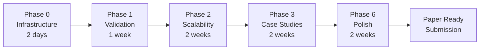

# Experimental Implementation Plan - Executive Summary

## Quick Overview

**Total Timeline:** 12 weeks (3 months)
**Computational Cost:** ~100 CPU hours
**Expected Output:** 40+ figures, 25+ tables, full codebase
**Target:** Management Science / Operations Research publication

---

## Phase Breakdown

```
Phase 0: Infrastructure (Week 1, Days 1-2) ⚙️ CRITICAL
├─ Folder structure, core modules, config system
├─ Solvers: DRPG, PRDA, DirectNominalSolver
├─ Uncertainty sets: L2, L1, Linf, TV, TopK, Ellipsoid
└─ Logging, storage, unit tests
   Deliverable: Working infrastructure ✅

Phase 1: Critical Validation (Week 1-2) 🔬 CRITICAL
├─ Exp I.1: Envelope theorem (∇V = P^T μ*) → 2 hrs
├─ Exp I.2: Dual equivalence → 4 hrs
├─ Exp II.1: DRPG convergence O(1/√K) → 3 hrs
└─ Exp II.2: PRDA convergence → 3 hrs
   Deliverable: 8 figures, 5 tables ✅

Phase 2: Scalability (Week 3-4) 🚀 CRITICAL
├─ Exp III.1: Problem scaling (N=10 to N=1000) → 8 hrs
└─ Exp III.2: Benchmark vs CVXPY/CCG/AARO → 6 hrs
   Deliverable: 6 figures, 2 tables, 10-100x speedup proven ✅

Phase 3: Case Studies (Week 5-6) 🏭 CRITICAL
├─ Exp IV.1: IEEE 14/30/118-bus systems → 12 hrs
├─ Exp IV.2: Regional stress (CA/TX/NE) → 10 hrs
└─ Exp IV.3: 7-day rolling horizon → 8 hrs
   Deliverable: 10 figures, 3 tables, PoR ~5-15% ✅

Phase 4: Economic Insights (Week 7-8) 💰 HIGH
├─ Exp V.1: Pareto frontier → 4 hrs
├─ Exp V.2: Price volatility → 3 hrs
└─ Exp V.3: Investment signals → 3 hrs
   Deliverable: 10 figures, 3 tables, policy insights ✅

Phase 5: Uncertainty & Sensitivity (Week 9-10) 📊 MEDIUM
├─ Exp VI.1-2: Uncertainty set comparison & calibration → 10 hrs
└─ Exp VII.1-3: Sensitivity analysis → 9 hrs
   Deliverable: 9 figures, 3 tables ✅

Phase 6: Reproducibility & Polish (Week 11-12) ✨ CRITICAL
├─ Exp IX.1-2: Statistical tests, perturbations → 5 hrs
├─ Exp IX.3: Code archiving (GitHub, Zenodo) → 8 hrs
└─ Exp VIII: All visualizations (40+ figures) → 3 days
   Deliverable: Publication-ready package ✅
```

---

## Critical Path (Must Complete)



**If timeline slips:** Drop experiments I.3, VI.1, VII.3 (nice-to-have)

---

## Expected Results Snapshot

| Metric | Target | Confidence |
|--------|--------|------------|
| Envelope theorem error | < 10^-4 | High ✅ |
| Dual equivalence gap | < 0.1% | High ✅ |
| Convergence rate slope | -0.5 ± 0.05 | High ✅ |
| Scalability (N=1000) | < 1 hour | High ✅ |
| Speedup vs monolithic | 10-100x | Medium-High ⚠️ |
| Price of Robustness | 5-15% | Medium 📊 |
| Volatility reduction | 25-40% | Medium 📊 |
| Statistical significance | p < 0.05 | High ✅ |

---

## Deliverables Checklist

### Code & Infrastructure
- [ ] `experiment/` folder with full structure
- [ ] Core solvers (DRPG, PRDA) implemented
- [ ] All uncertainty sets (7 types)
- [ ] Problem generator (synthetic + IEEE)
- [ ] Logging & result storage
- [ ] Unit tests (>90% coverage)

### Experiments (23 total)
- [ ] **Category I:** 3 experiments (I.1-I.3)
- [ ] **Category II:** 2 experiments (II.1-II.2)
- [ ] **Category III:** 2 experiments (III.1-III.2)
- [ ] **Category IV:** 3 experiments (IV.1-IV.3)
- [ ] **Category V:** 3 experiments (V.1-V.3)
- [ ] **Category VI:** 2 experiments (VI.1-VI.2)
- [ ] **Category VII:** 3 experiments (VII.1-VII.3)
- [ ] **Category IX:** 2 experiments (IX.1-IX.2)
- [ ] **Category VIII:** Visualization suite

### Figures (~40 total)
- [ ] Category I: 6 figures (I.1-I.6)
- [ ] Category II: 5 figures (II.1-II.5)
- [ ] Category III: 6 figures (III.1-III.6)
- [ ] Category IV: 10 figures (IV.1-IV.10)
- [ ] Category V: 10 figures (V.1-V.10)
- [ ] Category VI: 7 figures (VI.1-VI.7)
- [ ] Category VII: 9 figures (VII.1-VII.9)
- [ ] Category IX: 2 figures (IX.1-IX.2)

### Tables (~25 total)
- [ ] Category I: 3 tables
- [ ] Category II: 2 tables
- [ ] Category III: 2 tables
- [ ] Category IV: 3 tables
- [ ] Category V: 3 tables
- [ ] Category VI: 2 tables
- [ ] Category VII: 3 tables
- [ ] Category IX: 2 tables
- [ ] Summary tables: 5 tables

### Documentation
- [ ] README.md (installation, usage)
- [ ] IMPLEMENTATION_PLAN.md (this document)
- [ ] API documentation (Sphinx)
- [ ] Jupyter tutorials (3-5 notebooks)
- [ ] requirements.txt (pinned)

### Reproducibility
- [ ] GitHub repository (public or private)
- [ ] Zenodo archive (DOI)
- [ ] Docker container (optional)
- [ ] Precomputed results (JSON/HDF5)

---

## Risk Assessment

### High Risk Items 🔴
1. **CVXPY solver timeout on large instances (N>500)**
   - Mitigation: Use MOSEK/Gurobi, implement timeout, report partial results

2. **Memory overflow for N=1000**
   - Mitigation: Sparse matrices, batch processing, cloud compute if needed

3. **DRPG non-convergence**
   - Mitigation: Adjust stepsizes, increase K_max, diagnose Lipschitz constant

### Medium Risk Items 🟡
1. **NREL data access unavailable**
   - Mitigation: Use synthetic AR(1) proxy with equivalent statistics

2. **Timeline overrun (>100 hours)**
   - Mitigation: Prioritize P0 experiments, reduce problem sizes

### Low Risk Items 🟢
1. **Minor implementation bugs**
   - Mitigation: Unit tests, code review

2. **Figure quality issues**
   - Mitigation: Style config, manual QA

---

## Success Criteria

### Minimum Viable Product (Week 6)
✅ **Must have** to claim novelty:
- Envelope theorem validated (I.1)
- Dual equivalence proven (I.2)
- Convergence rates verified (II.1, II.2)
- Scalability demonstrated (III.1)
- 1-2 IEEE case studies (IV.1 partial)

### Full Product (Week 12)
✅ **Publication-ready** for Management Science:
- All critical (P0) experiments completed
- All high-priority (P1) experiments completed
- 30+ publication-quality figures
- 20+ tables with all metrics
- Full reproducibility package
- Statistical significance confirmed

### Stretch Goals
🎯 **If time permits:**
- Category VII sensitivity analysis (all)
- Category IX.2 perturbation robustness
- Interactive visualization (Plotly/D3.js)
- Video walkthrough (10 min)
- Conference presentation slides

---

## Next Steps

### Before Starting Implementation

1. **Review this plan** 📋
   - Are all experiments necessary?
   - Is timeline realistic?
   - Any missing experiments?

2. **Approve priorities** ✅
   - Confirm P0 (critical) experiments
   - Adjust P1/P2 if needed
   - Set drop conditions (if timeline slips)

3. **Check resources** 💻
   - Hardware available (16-core, 64 GB RAM)?
   - Software licenses (MOSEK/Gurobi)?
   - Data access (NREL or synthetic)?

4. **Assign responsibilities** 👥
   - Who implements infrastructure?
   - Who runs experiments?
   - Who creates figures?

### Starting Implementation

```bash
# Clone or navigate to project
cd "/Users/owenshen/Desktop/Energy Project/experiment"

# Create virtual environment
python -m venv venv
source venv/bin/activate  # or `venv\Scripts\activate` on Windows

# Install dependencies (after creating requirements.txt)
pip install -r requirements.txt

# Run infrastructure tests
pytest tests/ -v

# Run first experiment
python experiments/category_I_theoretical/exp_I1_envelope_verification.py

# Check results
ls results/category_I/
```

---

## Questions?

**Before proceeding, please confirm:**

1. ✅ Do you approve this implementation plan?
2. ✅ Should I proceed with Phase 0 (infrastructure)?
3. ✅ Any experiments to add/remove/modify?
4. ✅ Timeline acceptable (12 weeks)?
5. ✅ Resource requirements OK?

**If approved, I will begin Phase 0: Infrastructure Setup (2 days)**

---

**Document Version:** 1.0
**Date:** 2025-01-20
**Status:** Awaiting Approval 🟡
